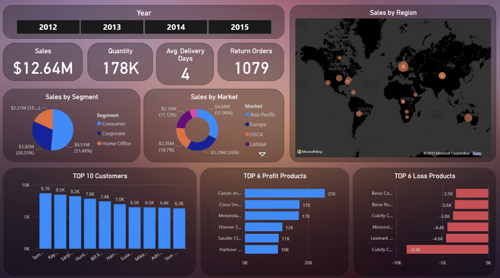

# 📊 Task 3: Dashboard_Sales_Performance

---

## 🎯 Objective

Design a fully interactive and stakeholder-friendly dashboard using **Power BI**, focused on sales and profit analysis. This project aims to help business users make data-driven decisions through real-time insights and interactive visual storytelling.

---

## 📁 Dataset

- **Name**: Superstore Sales Dataset  
- **Source**: [Kaggle - Superstore Sales](https://www.kaggle.com/datasets/vivek468/superstore-dataset-final)
- **Contains**: Sales, Profit, Category, Sub-category, Region, Segment, Discount, Quantity, Order Date, Ship Date

---

## 📌 KPIs Tracked

- Total Sales  
- Total Profit  
- Monthly Sales Trend  
- Profit by Sub-Category  
- Sales by Region  
- Orders by Segment  
- Discount vs Profit Correlation

---

## 🧰 Tools Used

- Power BI Desktop  
- Excel (optional preprocessing)  
- PowerPoint for Summary Presentation

---

## 🖥 Dashboard Features

| Feature              | Description                                                   |
|----------------------|---------------------------------------------------------------|
| 🎯 KPI Cards         | Cards showing key metrics like sales, profit, orders          |
| 📆 Time-Series       | Line charts for sales over time                               |
| 🗂 Category Filters   | Interactive slicers for Region, Category, Sub-Category        |
| 🎨 Consistent Theme  | Professional and minimalistic color palette                   |
| 📍 Interactivity      | Filters + page-level visuals + tooltip interactions           |

---

## 📸 Dashboard Preview

> Insert screenshots in the `images/` folder of this repo and link them like below:

  

---

## 📄 Files Included
- `Global Sales Dashboard Project.pbix` – Full Power BI dashboard
- `Global_superstore_data.xlsx` – Dataset used for the dashboard
- `Sales_Performance_Summary.pptx` – PPT of dashboard insights
---

## 📑 Business Insights

- 📌 **West** and **East** regions drive the highest revenue  
- 📌 **Furniture** discounts heavily reduce profit margins  
- 📌 **Corporate** segment yields highest profitability  
- 📌 Peak sales observed in **December** indicating seasonal trends

---

## 🧾 Recommendations

- Reduce discounting in underperforming categories  
- Focus on profitable segments like **Phones**, **Chairs**, and **Copiers**  
- Expand operations in regions with underutilized potential  
- Optimize inventory before high-sales months (Nov–Dec)

---
## ✅ Outcome

This project demonstrates my ability to develop **business-focused dashboards** using Power BI, with an emphasis on **interactive visual storytelling**, **clean UI**, and **actionable insights**.

---

## 📬 Contact
**Akash Kumar Rajak**    
Email: akashkumarrajak200@gmail.com  

